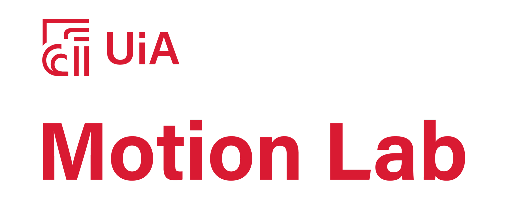
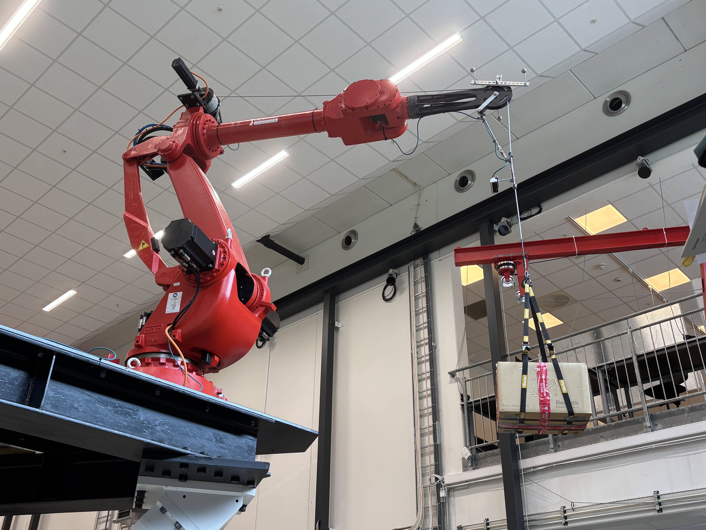

# Motion Lab Summer Project 2025
- Summer project with "The Norwegian Motion Laboratory" at UiA campus Grimstad
- Control of robot arm with suspended payload which is tracked with IMU sensors and cameras

 
 

## General Information

The project is done by Thomas Lønne Stiansen and Adrian Mathias Lervik Ling, based on previous works with the repository's foundation from the works done by Johannes Arnesen Eidsvik (and Oliver Solberg?)
- https://github.com/JohannesAE/Comau_TCP_Control
- https://github.com/JohannesAE/UIA-MotionLab-DigitalTwin?tab=readme-ov-file

Public documentation of the Norwegian Motion Laboratory is found at \
https://uia-mekatronikk.gitlab.io/motion-lab/comau.html


## User Guides

### Starting Comau Robot Arm Control

1) Turn switch on dark grey comau cabinet $90^\circ$ CW
2) Comau TP5 Teach Pendant: 
    1) MENU $\rightarrow$ Prog $\rightarrow$ startC5GOpen $\rightarrow$ Program $\rightarrow$ Deactivate
    2) DRIVE (go from gray to green)
    3) MENU $\rightarrow$ Prog $\rightarrow$ startC5GOpen $\rightarrow$ Program $\rightarrow$ Activate
    4) START
3) Changes to ```sg_IK.slx```? Run ```sg_IK_build.m```
4) Run ```sg_IK_startup.m```
5) MATLAB App: Set Stop Time = Inf
6) MATLAB App: Start

### Stopping Comau Robot Arm Control

1) MATLAB App: Enable Zero vel
2) Stop
3) Comau TP5 Teach Pendant: DRIVE (go from green to gray)

## File Structure

- ```mr``` = Functions from "Modern Robotics" by Lynch & Park
- ```Helper_functions``` = Functions from Johannes Arnesen Eidsvik
- ```sg_IK.slx``` SpeedGoat Inverse Kinematics Model (main)
- ```sg_IK.mldatx``` SpeedGoat Inverse Kinematics Model, compiled to be uploaded

## Prerequisites

- SpeedGoat Blockset: "9_4_0_1_R2021b_build_25363" to be installed on individual computer, accessed from SpeedGoat Customer Portal account or Daniel Hagen (responsible for the Motion Lab)
- Supported C++ Compiler: https://learn.microsoft.com/en-us/cpp/windows/latest-supported-vc-redist?view=msvc-170#visual-studio-2015-2017-2019-and-2022
- MATLAB 2021b is required with the following addons:
    - Simulink Coder
    - MATLAB Coder
    - Signal Processing Toolbox
    - DSP System Toolbox
    - Simulink Real-Time Target Support Package
    - Simulink Real-Time
    - Simulink
    - Robotics System Toolbox (not sure)

## Setup

- 1x 6-axis Robot Arm: COMAU NJ-110-3.0
- 2x Cameras: Luxonis OAK-D PRO
- Mx Motion Reference Unit: Kongsberg MRU